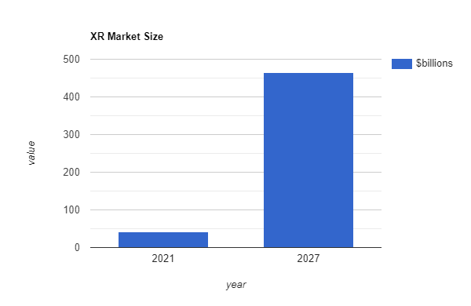

# Market Size \[IN-PROGRESS]

## Total XR Market Size

Based on available data from <mark style="color:green;">imarc</mark> and [<mark style="color:green;">MarketWatch</mark>](https://www.marketwatch.com/press-release/extended-reality-xr-market-size-2021-covid-19-impact-analysis-by-industry-trends-future-demands-growth-factors-emerging-technologies-prominent-players-future-plans-and-forecast-till-2030-2022-01-07), the total market size of XR is rising from $42 billion in 2021 to $465 billion by 2027 with a compounding annual growth rate (CAGR) of 46.20%.

We can draw some conclusions from this data.

* The \~46% annual growth rate includes hardware and software,&#x20;
* The growth of UnitedXR's market may be different since its software only
* It is very likely that the market size UnitedXR serves is growing each year

## NFTs Market Overview

According to [<mark style="color:green;">NonFungible</mark>](https://nonfungible.com/reports/2021/en/yearly-nft-market-report), the market for NFTs in 2021 was $15 billion with 2 million active wallets. Up from $18 million across 80,000 wallets in 2020.

#### Estimated NFT Market 2021 from NonFungible

| NFT Type     | NFTs Minted | Active Wallets |
| ------------ | ----------- | -------------- |
| Gaming       | 15,000,000  | 1,880,000      |
| Collectibles | 2,400,000   | 480,000        |
| Art          | 400,000     | 150,000        |
| Utility      | 330,000     | 222,000        |
| Metaverses   | 58,000      | 44,000         |

In 2021, there were roughly **4.6 million NFTs minted** across **2.7 million wallets**.

## What NFT Categories Do We Serve?

UnitedXR's ecosystem is most effective in the categories of gaming, collectibles, art, and metaverses. In 2021 this was a combined size of 4.3 million NFTs across 2.5 million wallets.&#x20;

The Utility category covers NFTs without a visual aspect, like governance NFTs in DAOs and ENS domains. These are specific and usually don't need an open marketplace to sell on.

## What Is Your Potential Market Share?

Based on the NFT categories we serve, our maximum potential is to sell 90% of all NFTs.

More realistically, we'll likely capture 40%-60% market share.

The assumption is that the other NFT marketplaces will adapt to our innovations in order to stay relevant, this will lessen our potential market share.

The easiest response other marketplaces can do is also switch to a similar regenerative token economic model we are using.

In this scenario, we still have our fully decentralized nature and unique XR tools in our ecosystem that will give us a unique edge.

## XR Creators

Estimated number of creators that would sell XR projects using our ecosystem

## XR Engineers

Estimated number of engineers that use closed source XR ecosystems

## XR Marketplaces

Estimated number of sales existing XR content marketplaces get
